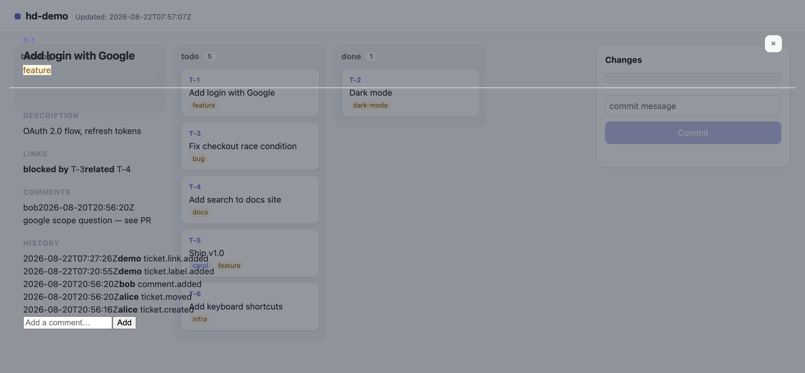
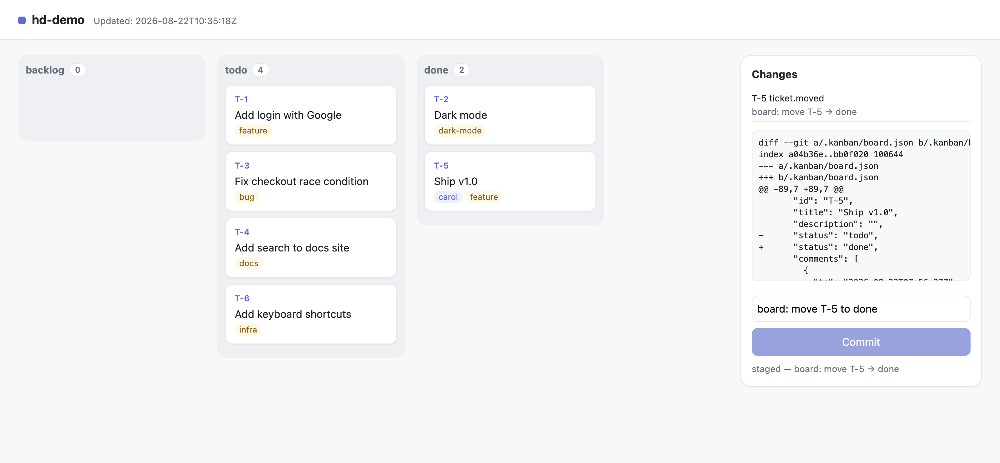
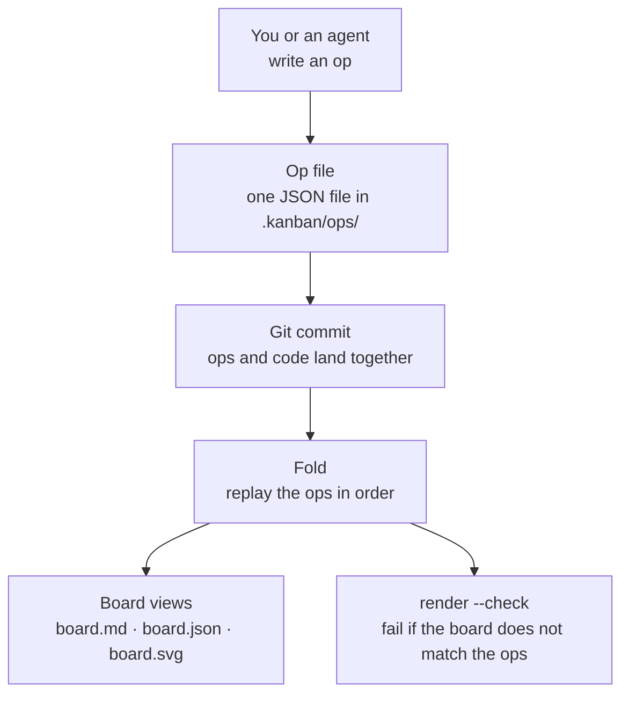

# hexdeck

[](https://github.com/danmurf/hexdeck/actions/workflows/ci.yml)
[](https://github.com/danmurf/hexdeck/actions/workflows/ci.yml)

A kanban board stored in git, built for AI agents. Tickets, columns, comments, and a progress timeline — all plain files in the repo. Agents and humans read and write the same files. No database, no server, no lock-in.

**Status: V1.** The board, the CLI, the CI pipeline, the local web view, and the MCP server are built, and hexdeck tracks its own build in `.kanban/`. V1.1 (snapshots) comes only if V1 earns it.

## Quick start

```
go install github.com/danmurf/hexdeck/cmd/hexdeck@latest
cd your-project
hexdeck init --as your-name          # create the board
hexdeck create "Fix login bug"       # new ticket (starts in backlog)
hexdeck move T-1 todo                # ready to pick up
hexdeck comment T-1 "on it"          # add a comment
hexdeck link T-1 blocks T-2          # T-2 waits until T-1 is done
hexdeck label T-1 feature            # label it: feature, bug, docs, infra
hexdeck show                         # print the board
hexdeck log --since 2d               # what happened recently
hexdeck pick --as your-name          # claim the next todo ticket
hexdeck render --check               # CI: board files match the ops
hexdeck web                          # local web view: drag, comment, commit
hexdeck mcp                          # MCP server: agents ask the board questions
```

Every change stages the op and the board files and prints a suggested commit message. `--commit` commits it. The board lives in `.kanban/` — read `.kanban/README.md` for the full manual.

Contributors run `make` — `make build` compiles the binary, `make test` runs the suite, `make render-check` verifies the boards. `make help` lists the targets.

## A real session

A fresh repo, five commands, real output:

```
$ hexdeck init --name demo
board "demo" created in .kanban
suggested commit: board: init demo

$ hexdeck create "Fix login bug"
T-1
suggested commit: board: create T-1

$ hexdeck move T-1 todo
suggested commit: board: move T-1 → todo

$ hexdeck comment T-1 "reproduced it"
suggested commit: board: comment on T-1

$ hexdeck show
# Board — demo
Updated: 2026-08-21T10:22:30Z · 0 backlog · 1 todo · 0 done

## backlog

## todo
- T-1 Fix login bug

## done
```

The board is the projection of the ops. Each ticket shows its id,
title, and claim; comments live on the ticket view — `hexdeck show T-1`
prints them. Nothing is stored twice.

## The web view

`hexdeck web` serves the board in your browser: drag tickets between
columns, comment, and commit the staged changes — same ops, same rules
as the CLI.


Cards show the id, title and the claim badge. Click a title to open
the ticket — a full view with the description, links, comments,
history, and the comment form:



Type a comment on a ticket to add it to the board:


Drag a ticket to another column. The changes panel shows what is
staged, the diff, and the suggested commit message:



Run `hexdeck web` in a project with a board, then open
<http://localhost:8080>.

## Key concepts

These words describe the board as a project management tool. This is the language you use day to day.

- **Board** — the whole kanban. It has three columns by default: `backlog`, `todo`, `done`.
- **Ticket** — one unit of work. Each ticket has an id like `T-1` and a title.
- **Column** — where a ticket sits. A ticket is in exactly one column at a time.
- **Move** — change a ticket's column. `hexdeck move T-1 todo`.
- **Claim** — mark a ticket as yours. `hexdeck pick --as your-name` claims the next `todo` ticket. A claim shows who is working on the ticket.
- **Release** — clear a claim. The ticket goes back to being unclaimed.
- **Comment** — a note on a ticket. Comments are part of the ticket's history.
- **Link** — a connection between two tickets. `blocks` says one must be done before the other; `related` says they are connected but neither comes first. `pick` skips a ticket whose blocker is not done.
- **Label** — a word on a ticket (`feature`, `bug`, `docs`, `infra`). The board card shows labels in brackets after the title, so a scan of the board groups the work.
- **Log** — the timeline of everything that happened on the board, newest first.

These words describe the inner workings of the app. You do not need them to use the board, but they explain why it behaves the way it does.

- **Op** — one event, stored as one JSON file in `.kanban/ops/`. Creating a ticket is an op. Moving it is an op. Every change is an op.
- **Ops are append-only** — ops are never edited or deleted. Corrections are new ops.
- **Fold** — the process that replays the ops in order to build the board state.
- **Projection** — the board files. The board is never stored; it is always rebuilt from the ops. Same ops, same board, always.
- **Render** — write the projection: `board.md` (for humans), `board.json` (for machines), `board.svg` (the image).
- **Sort order** — ops sort by `(seq, opId)`, so two writers who work at the same time never conflict when their work merges.

## How it works



## The board

A real board, rendered by hexdeck from real ops:


That image is generated from the ops in `docs/demo/ops`. The board is never drawn by hand — it is always a projection of the ops. Run `hexdeck render --svg --dir docs/demo` and you get the same image, byte for byte. CI runs `hexdeck render --check --dir docs/demo` on every push — a hand-edited or stale projection fails the build. The image at the repo root is checked too: CI re-renders it and fails if it drifted.

## The dogfood board

hexdeck tracks its own build in `.kanban/` — the board is the build tracker. The build worker creates, moves, and comments on tickets as it works. CI runs `hexdeck render --check --dir .kanban` on every push, so the dogfood board must match its ops too. Read `.kanban/board.md` to see where the build is up to.

## Docs

- [Tutorial](docs/tutorial.md) — a real session, step by step.
- [How-to guides](docs/how-to.md) — one task, one guide.
- [Reference](docs/reference.md) — commands, op types, config, rules.
- [Explanation](docs/architecture.md) — how the app works.
- [Contributing](docs/contributing.md) — how to work on hexdeck, for humans and agents.
- `docs/BUILD-SPEC.md` — the full spec.

## Development

```
go test ./...   # run the tests
```

Go 1.26+, stdlib only.
